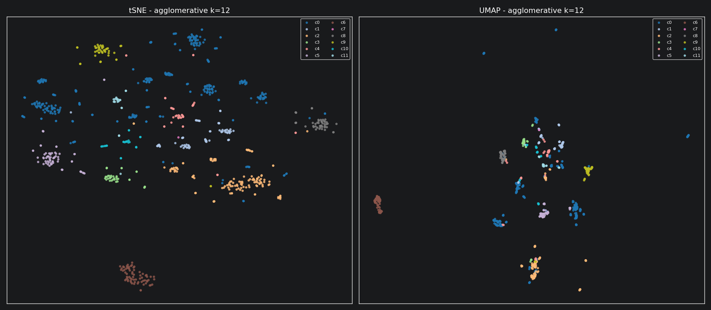
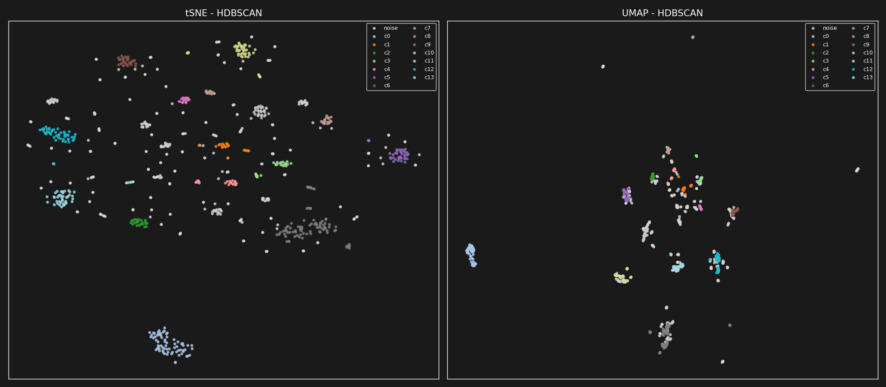
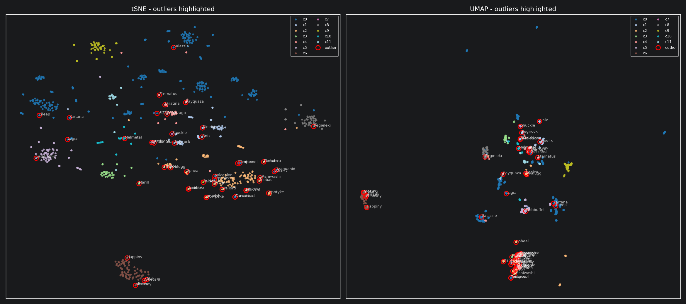

% Assignment 4 - Pokemon Analysis
% Eric Buchinger
% IEM.DAM2, SS 2026

# Assignment 4 - Pokemon Analysis

**Course:** IEM.DAM2, SS 2026
**Author:** Eric Buchinger
**Dataset:** `pokedex.csv` (898 Pokemon, 6 base stats, height/weight, 17 one-hot type columns, thumbnails)

---

## Overview

This document summarizes the solution to Assignment 4. The full implementation is in `main.py` (script) and `ue04_analysis.ipynb` (annotated notebook). Dependencies are managed with `uv` (`pyproject.toml`, `uv.lock`); reproduce with `uv sync`.

The five tasks were:

1. Design a meaningful distance function and compute the pairwise distance matrix.
2. Cluster the Pokemon and justify the parameters with the silhouette score.
3. Visualize the clustering in 2D with tSNE and UMAP.
4. Identify outliers and characterize them.
5. Discuss findings and reflect on the process.

---

## 1. Distance Function

A Pokemon is described by three very different kinds of attributes, so a single metric on the raw feature vector doesn't make sense. Instead I built **three normalized distance blocks** and combined them with weights.

| Block      | Features                                              | Metric                                | Why                                                                                                 |
|------------|-------------------------------------------------------|---------------------------------------|-----------------------------------------------------------------------------------------------------|
| **Stats**  | HP, Attack, Defense, Sp. Atk, Sp. Def, Speed          | standardized Euclidean                | continuous values; z-scoring makes magnitudes comparable                                            |
| **Types**  | 17 one-hot type columns                                | Jaccard                               | set similarity; "water+ice" stays close to "water+flying" but far from "fire+rock"                  |
| **Size**   | height, weight                                         | standardized Euclidean on `log1p`     | heavy-tailed; `log1p` dampens Wailord-style outliers dominating the metric                          |

Each block is rescaled into roughly `[0, 1]` and then combined as

$$D = w_{\text{stats}}\, D_{\text{stats}} + w_{\text{types}}\, D_{\text{types}} + w_{\text{size}}\, D_{\text{size}}$$

with defaults `(0.5, 0.4, 0.1)` - stats are the richest signal, types a strong secondary vote, size a small nudge.

### Sanity check

Nearest neighbours of a few well-known Pokemon line up with intuition:

- **Bulbasaur** -> Caterpie, Weedle, Oddish (small Grass/Bug starters)
- **Charizard** -> Salamence, Dragonite, Aerodactyl (high-stat Flying/Dragon)
- **Pikachu** -> Raichu, Pichu, other Electric mice
- **Snorlax** -> Munchlax, Vigoroth, Hariyama (heavy, high-HP)

Resulting matrix is `898 x 898` with `min=0`, `mean≈0.52`, `max≈0.94`.

---

## 2. Clustering

**Algorithm:** agglomerative clustering with **average linkage** - it consumes a precomputed distance matrix directly and is robust to non-Euclidean metrics. I swept `k` from 3 to 12 and picked the `k` with the best silhouette score (computed on the precomputed distance).

### Silhouette results

| k   | 3      | 4      | 5      | 6      | 7      | 8      | 9      | 10     | 11     | 12         |
|-----|--------|--------|--------|--------|--------|--------|--------|--------|--------|------------|
| sil | 0.0677 | 0.0682 | 0.0689 | 0.0935 | 0.1442 | 0.1576 | 0.1833 | 0.2065 | 0.2147 | **0.2551** |

**Chosen k = 12** (silhouette = 0.2551). Scores rise monotonically, which is a hint that the dataset is more of a continuum than a set of well-separated clusters.

**HDBSCAN** (density-based, `min_cluster_size=15`, `min_samples=5`) found 14 clusters and labelled **367 points as noise** (~40 %), reinforcing the same conclusion: many Pokemon live in sparse regions of the metric.

---

## 3. Visualization (tSNE & UMAP)

Both algorithms accept the precomputed distance directly.

- **tSNE**: `perplexity=30`, `init="random"` - a sensible default for ~900 points.
- **UMAP**: `n_neighbors=20`, `min_dist=0.1` - tighter, more cluster-like blobs than the defaults.





Both embeddings show the same coarse structure: high-stat / legendary Pokemon at one end, small early-stage Pokemon at the other, and type-flavored sub-blobs in between (water, bug, rock groups are visible). HDBSCAN's noise points scatter across the boundaries, exactly where outliers should sit.

---

## 4. Outlier Detection

I used three complementary lenses and looked for **consensus**:

- **Local Outlier Factor (LOF)** on the precomputed distance - flags points whose local density is much lower than that of their neighbours.
- **Isolation Forest** on the distance rows - flags points whose "distance fingerprint" is unusual overall (more global).
- **HDBSCAN noise** - points that couldn't be placed into any cluster.

With `contamination = 0.03`, each of LOF and Isolation Forest flagged 27 Pokemon; HDBSCAN flagged 367.

### Top consensus outliers

| Name       | Stat total | Types            | Flags         |
|------------|------------|------------------|---------------|
| Chansey    | 450        | (none / normal)  | LOF + ISO     |
| Blissey    | 540        | (none / normal)  | LOF + ISO     |
| Shuckle    | 505        | bug, rock        | ISO + HDB     |
| Steelix    | 510        | ground, steel    | ISO + HDB     |
| Lugia      | 680        | psychic, flying  | ISO + HDB     |
| Wobbuffet  | 405        | psychic          | ISO           |
| Poliwrath  | 510        | water, fighting  | LOF + HDB     |
| Lanturn    | 460        | water, electric  | LOF + HDB     |
| Marill     | 250        | water, fairy     | LOF + HDB     |



### What makes them outliers?

Four recurring patterns:

- **Unusual stat shapes** - Chansey/Blissey have huge HP but almost no defenses; Shuckle has extreme defenses and barely any offense.
- **Unusual type combinations** - Water+Electric (Lanturn), Water+Fighting (Poliwrath), Bug+Rock (Shuckle) are rare combos far from the dense type clusters.
- **Unusual size** - Steelix (~400 kg) sits in the tail of the size distribution.
- **Legendaries** - high stat totals plus rare type combos (Lugia: Psychic+Flying, total 680).

All four are exactly the kind of "different" we'd want an outlier method to catch.

---

## 5. Discussion and Reflection

### What worked well

- The block-based distance (stats + types + size) is interpretable and easy to tune. Swapping the weights moves the clustering between "stat-driven" and "type-driven" in a predictable way.
- Average-linkage agglomerative on the precomputed matrix paired nicely with the silhouette sweep - no need to re-derive features for the clustering step.
- Multiple outlier methods cross-checking each other gave more confidence than any single method. The consensus list (Chansey, Blissey, Shuckle, Steelix, Lugia, ...) reads exactly like the Pokemon a fan would point at as "weird".

### Challenges

- Choosing block weights is subjective. Type Jaccard is coarse (most Pokemon share at most 1-2 types), so it had to be downweighted relative to stats to avoid one giant blob per type.
- Height/weight are heavy-tailed; without `log1p` Wailord dominates the size distance.
- Silhouette on a mixed distance is a relative signal, not absolute - "best k" just means "least bad among the values tried". Scores kept climbing with `k`, which suggests the data is more of a continuum than well-separated clusters.
- HDBSCAN labelling ~40 % of points as noise reinforces that density is very uneven.

### If I had more time

- **Use the thumbnails** - feed them through a pretrained CNN (CLIP or a small ResNet) and add an image-embedding block to the distance.
- **Tune block weights** with a grid search against a downstream metric (type-purity of clusters, or recovery of known evolutionary families).
- **Compare more clustering algorithms** (spectral, OPTICS, k-medoids) and report stability across random seeds.
- **Per-generation analysis** - cluster within and across generations to see whether stat power creep shows up as drift in the embedding.

---

## Reproducing the analysis

```bash
uv sync                                    # install dependencies
uv run python main.py                      # run the script (regenerates figures/)
uv run jupyter lab ue04_solution.ipynb     # interactive notebook
```

Files:

- `main.py` - end-to-end script
- `ue04_analysis.ipynb` - annotated notebook
- `pyproject.toml`, `uv.lock` - dependency pinning
- `figures/` - generated PNGs
